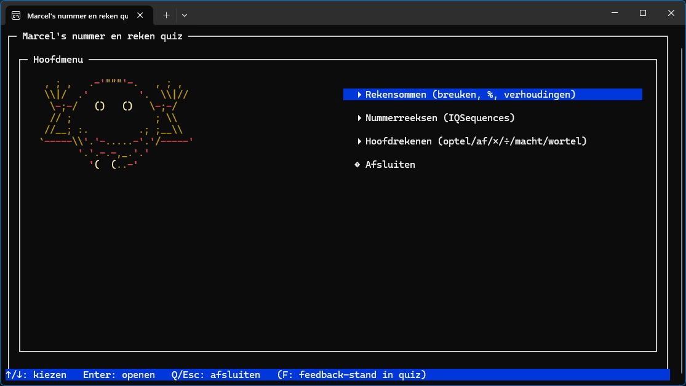
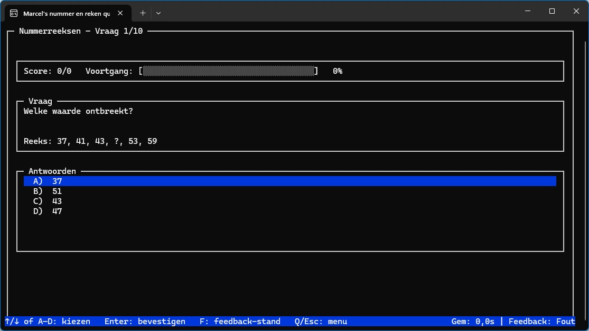
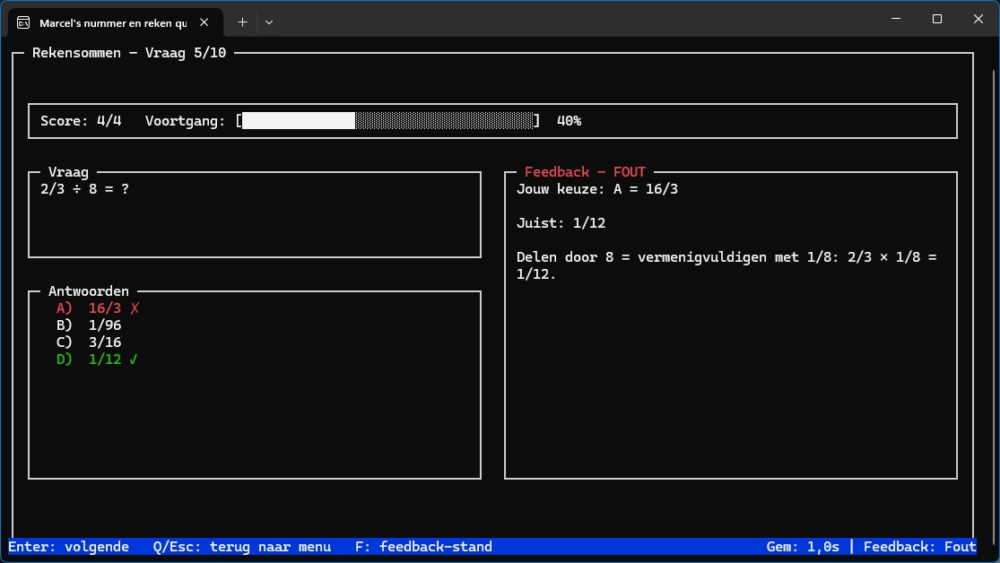

# Marcel's Math and Number Quiz

Een **console-gebaseerde quiz game** om wiskunde, nummerreeksen en hoofdrekenen te oefenen —  
gebouwd in C# en geïnspireerd door de look & feel van klassieke `ncurses` interfaces.






---

## ✨ Functies

- **Interactieve console UI**  
  Volledig scherm met panelen, voortgangsbalk, gekleurde highlights en multiple choice antwoorden.

- **Drie quiz-modi**  
  - **Rekensommen** → Breuken, percentages, verhoudingen, algebra-achtige uitdrukkingen.  
  - **Nummerreeksen (IQSequences)** → Oefen reeksen zoals rekenkundig, meetkundig, Fibonacci, priemgetallen, afwisselende stappen en meer.  
  - **Hoofdrekenen** → Oefen optellen, aftrekken, vermenigvuldigen, delen, machten en wortels.

- **Feedback-systeem**  
  - Laat direct zien of je antwoord goed of fout is (groen/rood).  
  - Wissel feedback-modus met `F`: alleen fouten, altijd tonen, of uit.  

- **Timer-modus**  
  - Optionele aftelklok (standaard 15 minuten).  
  - Toont resterende tijd en stopt de quiz automatisch.  
  - Houdt ook gemiddelde antwoordtijd per vraag bij.

- **Willekeurige multiple choice**  
  - Correct antwoord + 3 afleiders, telkens door elkaar gehusseld.  
  - Ondersteunt seed-instellingen voor herhaalbare sessies.

- **ASCII art intro**  
  Een vrolijke smiley heet je welkom in het hoofdmenu.

---

## 🕹️ Spelregels

1. **Start de app**  
   Draai het gecompileerde `.exe` bestand in je terminal / console.

2. **Kies een quiz**  
   Gebruik de pijltjestoetsen (`↑/↓`) en `Enter` om te kiezen:
   - Rekensommen  
   - Nummerreeksen (IQSequences)  
   - Hoofdrekenen  
   - Afsluiten  

3. **Beantwoord vragen**  
   - Gebruik `↑/↓` om een antwoord A–D te selecteren  
   - Bevestig met `Enter`  
   - Druk op `Q` of `Esc` om tussentijds te stoppen

4. **Trainingsopties**  
   - Druk op `F` tijdens een quiz om feedback-modus te wisselen  
   - Met de timer aan zie je ook een aftelklok en gemiddelde reactietijd  

---

## 📸 Screenshots

<p align="center">
  
</p>

---

## ⚙️ Installatie

### Vereisten
- [.NET 9.0 SDK](https://dotnet.microsoft.com/) of hoger

### Bouwen
```bash
git clone https://github.com/mvdbosch/marcel-math-number-quiz.git
cd marcel-math-number-quiz
dotnet build
